# RocketRest

RocketRest is a small Java 8 library for making HTTP API requests with a clean, fluent interface. It provides both synchronous and asynchronous APIs, abstracting away the underlying HTTP client implementation.

## Features

- Only 2 Dependencies: Jackson for JSON and SLF4J.
- Default Client implementation using `HttpUrlConnection` as vanilla as we can.
- Abstract architecture allowing different HTTP client implementations.
- Support for both synchronous and asynchronous requests using `CompletableFuture`.
- Automatic JSON serialization/deserialization.
- Fluent API for HTTP requests (GET, POST, PUT, DELETE).
- Result pattern for elegant error handling.
- Pluggable authentication strategies.
- Customizable error handling
- Circuit breaker pattern for resilient API calls
- Factory-based client creation with decorators
- Comprehensive mocking support for testing
- Pluggable credential-refresh hooks (e.g., custom logic for bearer tokens)

## Motivation

Over the years, I've accumulated a collection of standards and patterns for making HTTP requests in Java applications. RocketRest is my attempt to bring everything together in a single project that's compatible with JDK 8 with minimal dependencies. Working with legacy Java projects taught me the importance of having a modern, fluent API without requiring the latest JDK or carrying heavy dependency baggage. This library is an attempt to bring balance between contemporary design with legacy compatibility.

## Quick Start

Add RocketRest to your Maven project:

```xml
<dependency>
    <groupId>com.guinetik</groupId>
    <artifactId>rocketrest-core</artifactId>
    <version>1.0.0</version>
</dependency>
```

Make your first API call:

```java
// Create a simple client
RocketRest client = new RocketRest("https://api.example.com");

// Make a GET request
User user = client.get("/users/1", User.class);
System.out.println("Hello, " + user.getName());

// Don't forget to shutdown when done
client.shutdown();
```

## Usage Example

```java
// Create configuration with default options
RocketRestConfig config = RocketRestConfig.builder("https://api.example.com")
        .authStrategy(AuthStrategyFactory.createBearerToken("your-api-token"))
        .defaultOptions(options -> {
            options.set(RocketRestOptions.RETRY_ENABLED, true);
            options.set(RocketRestOptions.MAX_RETRIES, 3);
            options.set(RocketRestOptions.LOG_REQUEST_BODY, true);
        })
        .build();

// Create RocketRest client (inherits default options from config)
RocketRest client = new RocketRest(config);

try {
    // Synchronous API
    User user = client.sync().get("/users/1", User.class);
    
    // Asynchronous API with CompletableFuture
    CompletableFuture<User> futureUser = client.async().get("/users/2", User.class);
    futureUser.thenAccept(u -> System.out.println("Received user: " + u.getName()));
    
    // Fluent API with Result pattern for elegant error handling
    Result<User, ApiError> result = client.fluent().get("/users/3", User.class);
    result.match(
        user -> System.out.println("Success: " + user.getName()),
        error -> System.err.println("Error: " + error.getMessage())
    );
    
    // Direct access methods (uses sync API internally)
    User createdUser = client.post("/users", new User("John", "john@example.com"), User.class);
    
} finally {
    // Shutdown the client to release resources
    client.shutdown();
}
```

## Overview

```mermaid
flowchart TD
    RocketRest["RocketRest (Facade API)"]:::facade

    subgraph "Configuration"
        Config["RocketRestConfig"]:::core
        Options["RocketRestOptions"]:::core
        SecureConfig["RocketRestSecureConfig"]:::core
    end

    subgraph "API Client Layer"
        AbstractApiClient["AbstractApiClient"]:::core
        DefaultApiClient["DefaultApiClient"]:::core
        AsyncApiClient["AsyncApiClient"]:::core
        FluentApiClient["FluentApiClient"]:::core
    end

    subgraph "HTTP Transport & Decorators"
        Factory["RocketClientFactory"]:::core
        RCInterface["RocketClient (interface)"]:::transport
        DefaultHttpClient["DefaultHttpClient"]:::transport
        AsyncHttpClient["AsyncHttpClient"]:::transport
        CircuitBreakerClient["CircuitBreakerClient"]:::transport
        MockRocketClient["MockRocketClient"]:::transport
    end

    subgraph "Auth Strategies"
        AuthFactory["AuthStrategyFactory"]:::core
        BasicAuthStrategy["BasicAuthStrategy"]:::strategy
        BearerTokenStrategy["BearerTokenStrategy"]:::strategy
        NoAuthStrategy["NoAuthStrategy"]:::strategy
        AbstractOAuth2["AbstractOAuth2Strategy"]:::strategy
        OAuth2AssertionStrategy["OAuth2AssertionStrategy"]:::strategy
        OAuth2ClientCredStrategy["OAuth2ClientCredentialsStrategy"]:::strategy
        OAuth2PasswordStrategy["OAuth2PasswordStrategy"]:::strategy
    end

    subgraph "JSON, Request & Result Utilities"
        JsonObjectMapper["JsonObjectMapper"]:::utils
        RequestBuilder["RequestBuilder"]:::utils
        RequestSpec["RequestSpec"]:::utils
        Result["Result"]:::utils
        ApiError["ApiError"]:::utils
        ResponseLogger["ResponseLogger"]:::utils
        StreamUtils["StreamUtils"]:::utils
    end

    Examples["Examples Module"]:::facade

    Examples -->|"uses"| RocketRest
    RocketRest -->|configures| Config
    RocketRest -->|configures| Options
    RocketRest -->|configures| SecureConfig
    RocketRest -->|delegates to| AbstractApiClient
    RocketRest -->|delegates to| AsyncApiClient
    RocketRest -->|delegates to| FluentApiClient

    AbstractApiClient -->|"builds client"| Factory
    DefaultApiClient -->|"builds client"| Factory
    AsyncApiClient -->|"builds client"| Factory
    FluentApiClient -->|"builds client"| Factory

    Factory -->|creates| RCInterface
    RCInterface -->|"executes"| DefaultHttpClient
    RCInterface -->|"executes"| AsyncHttpClient
    RCInterface -->|"wraps"| CircuitBreakerClient
    RCInterface -->|"mockable"| MockRocketClient

    CircuitBreakerClient -->|"decorates"| DefaultHttpClient
    CircuitBreakerClient -->|"decorates"| AsyncHttpClient

    Factory -->|"selects strategy"| AuthFactory
    AuthFactory -->|"provides"| BasicAuthStrategy
    AuthFactory -->|"provides"| BearerTokenStrategy
    AuthFactory -->|"provides"| NoAuthStrategy
    AuthFactory -->|"provides"| AbstractOAuth2
    AbstractOAuth2 -->|"extends"| OAuth2AssertionStrategy
    AbstractOAuth2 -->|"extends"| OAuth2ClientCredStrategy
    AbstractOAuth2 -->|"extends"| OAuth2PasswordStrategy

    DefaultApiClient -->|uses| RequestBuilder
    AsyncApiClient -->|uses| RequestBuilder
    FluentApiClient -->|uses| RequestBuilder
    RequestBuilder -->|defines| RequestSpec
    RequestBuilder -->|injects auth| AuthFactory

    DefaultHttpClient -->|serializes| JsonObjectMapper
    AsyncHttpClient -->|serializes| JsonObjectMapper
    JsonObjectMapper -->|maps to| Result
    JsonObjectMapper -->|maps errors to| ApiError

    DefaultHttpClient -->|logs| ResponseLogger
    DefaultHttpClient -->|streams| StreamUtils

    classDef facade fill:#BBDEFB,stroke:#000;
    classDef core fill:#C8E6C9,stroke:#000;
    classDef transport fill:#FFE0B2,stroke:#000;
    classDef strategy fill:#FFF9C4,stroke:#000;
    classDef utils fill:#CFD8DC,stroke:#000;

    click RocketRest "https://github.com/guinetik/rocketrest/blob/master/rocketrest-core/src/main/java/com/guinetik/rr/RocketRest.java"
    click Config "https://github.com/guinetik/rocketrest/blob/master/rocketrest-core/src/main/java/com/guinetik/rr/RocketRestConfig.java"
    click Options "https://github.com/guinetik/rocketrest/blob/master/rocketrest-core/src/main/java/com/guinetik/rr/RocketRestOptions.java"
    click SecureConfig "https://github.com/guinetik/rocketrest/blob/master/rocketrest-core/src/main/java/com/guinetik/rr/RocketRestSecureConfig.java"
    click Factory "https://github.com/guinetik/rocketrest/blob/master/rocketrest-core/src/main/java/com/guinetik/rr/http/RocketClientFactory.java"
    click AbstractApiClient "https://github.com/guinetik/rocketrest/blob/master/rocketrest-core/src/main/java/com/guinetik/rr/api/AbstractApiClient.java"
    click DefaultApiClient "https://github.com/guinetik/rocketrest/blob/master/rocketrest-core/src/main/java/com/guinetik/rr/api/DefaultApiClient.java"
    click AsyncApiClient "https://github.com/guinetik/rocketrest/blob/master/rocketrest-core/src/main/java/com/guinetik/rr/api/AsyncApiClient.java"
    click FluentApiClient "https://github.com/guinetik/rocketrest/blob/master/rocketrest-core/src/main/java/com/guinetik/rr/api/FluentApiClient.java"
    click RCInterface "https://github.com/guinetik/rocketrest/blob/master/rocketrest-core/src/main/java/com/guinetik/rr/http/RocketClient.java"
    click DefaultHttpClient "https://github.com/guinetik/rocketrest/blob/master/rocketrest-core/src/main/java/com/guinetik/rr/http/DefaultHttpClient.java"
    click AsyncHttpClient "https://github.com/guinetik/rocketrest/blob/master/rocketrest-core/src/main/java/com/guinetik/rr/http/AsyncHttpClient.java"
    click CircuitBreakerClient "https://github.com/guinetik/rocketrest/blob/master/rocketrest-core/src/main/java/com/guinetik/rr/http/CircuitBreakerClient.java"
    click MockRocketClient "https://github.com/guinetik/rocketrest/blob/master/rocketrest-core/src/main/java/com/guinetik/rr/http/MockRocketClient.java"
    click AuthFactory "https://github.com/guinetik/rocketrest/blob/master/rocketrest-core/src/main/java/com/guinetik/rr/auth/AuthStrategyFactory.java"
    click BasicAuthStrategy "https://github.com/guinetik/rocketrest/blob/master/rocketrest-core/src/main/java/com/guinetik/rr/auth/BasicAuthStrategy.java"
    click BearerTokenStrategy "https://github.com/guinetik/rocketrest/blob/master/rocketrest-core/src/main/java/com/guinetik/rr/auth/BearerTokenStrategy.java"
    click NoAuthStrategy "https://github.com/guinetik/rocketrest/blob/master/rocketrest-core/src/main/java/com/guinetik/rr/auth/NoAuthStrategy.java"
    click AbstractOAuth2 "https://github.com/guinetik/rocketrest/blob/master/rocketrest-core/src/main/java/com/guinetik/rr/auth/AbstractOAuth2Strategy.java"
    click OAuth2AssertionStrategy "https://github.com/guinetik/rocketrest/blob/master/rocketrest-core/src/main/java/com/guinetik/rr/auth/OAuth2AssertionStrategy.java"
    click OAuth2ClientCredStrategy "https://github.com/guinetik/rocketrest/blob/master/rocketrest-core/src/main/java/com/guinetik/rr/auth/OAuth2ClientCredentialsStrategy.java"
    click OAuth2PasswordStrategy "https://github.com/guinetik/rocketrest/blob/master/rocketrest-core/src/main/java/com/guinetik/rr/auth/OAuth2PasswordStrategy.java"
    click JsonObjectMapper "https://github.com/guinetik/rocketrest/blob/master/rocketrest-core/src/main/java/com/guinetik/rr/json/JsonObjectMapper.java"
    click RequestBuilder "https://github.com/guinetik/rocketrest/blob/master/rocketrest-core/src/main/java/com/guinetik/rr/request/RequestBuilder.java"
    click RequestSpec "https://github.com/guinetik/rocketrest/blob/master/rocketrest-core/src/main/java/com/guinetik/rr/request/RequestSpec.java"
    click Result "https://github.com/guinetik/rocketrest/blob/master/rocketrest-core/src/main/java/com/guinetik/rr/result/Result.java"
    click ApiError "https://github.com/guinetik/rocketrest/blob/master/rocketrest-core/src/main/java/com/guinetik/rr/result/ApiError.java"
    click ResponseLogger "https://github.com/guinetik/rocketrest/blob/master/rocketrest-core/src/main/java/com/guinetik/rr/util/ResponseLogger.java"
    click StreamUtils "https://github.com/guinetik/rocketrest/blob/master/rocketrest-core/src/main/java/com/guinetik/rr/util/StreamUtils.java"
    click Examples "https://github.com/guinetik/rocketrest/tree/master/examples/src/main/java/com/guinetik/examples/"
```


## More Examples

Check out the [examples directory](./examples) for more detailed usage examples:

- [Simple Todo Example](./examples/src/main/java/com/guinetik/examples/JsonTodoExample.java) - Basic GET request with JSON parsing
- [Weather API Example](./examples/src/main/java/com/guinetik/examples/WeatherExample.java) - Using async API with wttr.in
- [PokéAPI Browser](./examples/src/main/java/com/guinetik/examples/PokeApiExample.java) - Working with pagination
- [NASA APOD API](./examples/src/main/java/com/guinetik/examples/NasaApodExample.java) - Using the fluent API with Result pattern

To run the examples:

```bash
# Install the core library
cd rocketrest-core
mvn clean install

# Run the examples
cd ../examples
mvn compile exec:java
```

### Creating Basic Clients

```java
// Create a default HTTP client
RocketClient client = RocketClientFactory.builder("https://api.example.com")
    .withOptions(options)
    .build();

// Create an async HTTP client
ExecutorService executor = Executors.newFixedThreadPool(4);
AsyncHttpClient asyncClient = RocketClientFactory.builder("https://api.example.com")
    .withOptions(options)
    .withExecutorService(executor)
    .buildAsync();
```

### Creating Clients with Circuit Breaker

```java
// Create a client with default circuit breaker settings
RocketClient client = RocketClientFactory.builder("https://api.example.com")
    .withCircuitBreaker()
    .build();

// Create a client with custom circuit breaker settings
RocketClient client = RocketClientFactory.builder("https://api.example.com")
    .withCircuitBreaker(5, 30000)  // 5 failures, 30 second timeout
    .build();

// Create a client with fully customized circuit breaker
RocketClient client = RocketClientFactory.builder("https://api.example.com")
    .withCircuitBreaker(
        5,                                              // 5 failures before opening
        30000,                                          // 30 second reset timeout
        60000,                                          // 1 minute failure decay
        CircuitBreakerClient.FailurePolicy.SERVER_ERRORS_ONLY  // Only count server errors
    )
    .build();
```

### Creating from Configuration

```java
// Create a builder pre-configured from RocketRestConfig
RocketClient client = RocketClientFactory.fromConfig(config)
    .withCircuitBreaker()
    .build();

// Create a default client directly from config
RocketClient client = RocketClientFactory.createDefaultClient(config);
```

### Adding Custom Decorators

```java
// Add a custom decorator to the client
RocketClient client = RocketClientFactory.builder("https://api.example.com")
    .withCustomDecorator(baseClient -> new MyCustomClientDecorator(baseClient))
    .build();

// Combine circuit breaker with custom decorator
RocketClient client = RocketClientFactory.builder("https://api.example.com")
    .withCircuitBreaker()
    .withCustomDecorator(baseClient -> new MyCustomClientDecorator(baseClient))
    .build();
```