# RocketRest

This document provides comprehensive documentation for the RocketRest library. It serves as both a reference guide and architectural overview to help developers (primarily me) understand and effectively use the library's features and capabilities.

Key aspects covered:
- Core concepts and design principles
- Configuration and options system
- Client creation and usage patterns
- Authentication and security
- Error handling and resilience features
- Extension points and customization

## Overview

```mermaid
flowchart TD
    RocketRest["RocketRest (Facade API)"]:::facade

    subgraph "Configuration"
        Config["RocketRestConfig"]:::core
        Options["RocketRestOptions"]:::core
        SecureConfig["RocketRestSecureConfig"]:::core
    end

    subgraph "API Client Layer"
        AbstractApiClient["AbstractApiClient"]:::core
        DefaultApiClient["DefaultApiClient"]:::core
        AsyncApiClient["AsyncApiClient"]:::core
        FluentApiClient["FluentApiClient"]:::core
    end

    subgraph "HTTP Transport & Decorators"
        Factory["RocketClientFactory"]:::core
        RCInterface["RocketClient (interface)"]:::transport
        DefaultHttpClient["DefaultHttpClient"]:::transport
        AsyncHttpClient["AsyncHttpClient"]:::transport
        CircuitBreakerClient["CircuitBreakerClient"]:::transport
        MockRocketClient["MockRocketClient"]:::transport
    end

    subgraph "Auth Strategies"
        AuthFactory["AuthStrategyFactory"]:::core
        BasicAuthStrategy["BasicAuthStrategy"]:::strategy
        BearerTokenStrategy["BearerTokenStrategy"]:::strategy
        NoAuthStrategy["NoAuthStrategy"]:::strategy
        AbstractOAuth2["AbstractOAuth2Strategy"]:::strategy
        OAuth2AssertionStrategy["OAuth2AssertionStrategy"]:::strategy
        OAuth2ClientCredStrategy["OAuth2ClientCredentialsStrategy"]:::strategy
        OAuth2PasswordStrategy["OAuth2PasswordStrategy"]:::strategy
    end

    subgraph "JSON, Request & Result Utilities"
        JsonObjectMapper["JsonObjectMapper"]:::utils
        RequestBuilder["RequestBuilder"]:::utils
        RequestSpec["RequestSpec"]:::utils
        Result["Result"]:::utils
        ApiError["ApiError"]:::utils
        ResponseLogger["ResponseLogger"]:::utils
        StreamUtils["StreamUtils"]:::utils
    end

    Examples["Examples Module"]:::facade

    Examples -->|"uses"| RocketRest
    RocketRest -->|configures| Config
    RocketRest -->|configures| Options
    RocketRest -->|configures| SecureConfig
    RocketRest -->|delegates to| AbstractApiClient
    RocketRest -->|delegates to| AsyncApiClient
    RocketRest -->|delegates to| FluentApiClient

    AbstractApiClient -->|"builds client"| Factory
    DefaultApiClient -->|"builds client"| Factory
    AsyncApiClient -->|"builds client"| Factory
    FluentApiClient -->|"builds client"| Factory

    Factory -->|creates| RCInterface
    RCInterface -->|"executes"| DefaultHttpClient
    RCInterface -->|"executes"| AsyncHttpClient
    RCInterface -->|"wraps"| CircuitBreakerClient
    RCInterface -->|"mockable"| MockRocketClient

    CircuitBreakerClient -->|"decorates"| DefaultHttpClient
    CircuitBreakerClient -->|"decorates"| AsyncHttpClient

    Factory -->|"selects strategy"| AuthFactory
    AuthFactory -->|"provides"| BasicAuthStrategy
    AuthFactory -->|"provides"| BearerTokenStrategy
    AuthFactory -->|"provides"| NoAuthStrategy
    AuthFactory -->|"provides"| AbstractOAuth2
    AbstractOAuth2 -->|"extends"| OAuth2AssertionStrategy
    AbstractOAuth2 -->|"extends"| OAuth2ClientCredStrategy
    AbstractOAuth2 -->|"extends"| OAuth2PasswordStrategy

    DefaultApiClient -->|uses| RequestBuilder
    AsyncApiClient -->|uses| RequestBuilder
    FluentApiClient -->|uses| RequestBuilder
    RequestBuilder -->|defines| RequestSpec
    RequestBuilder -->|injects auth| AuthFactory

    DefaultHttpClient -->|serializes| JsonObjectMapper
    AsyncHttpClient -->|serializes| JsonObjectMapper
    JsonObjectMapper -->|maps to| Result
    JsonObjectMapper -->|maps errors to| ApiError

    DefaultHttpClient -->|logs| ResponseLogger
    DefaultHttpClient -->|streams| StreamUtils

    classDef facade fill:#BBDEFB,stroke:#000;
    classDef core fill:#C8E6C9,stroke:#000;
    classDef transport fill:#FFE0B2,stroke:#000;
    classDef strategy fill:#FFF9C4,stroke:#000;
    classDef utils fill:#CFD8DC,stroke:#000;

    click RocketRest "https://github.com/guinetik/rocketrest/blob/master/rocketrest-core/src/main/java/com/guinetik/rr/RocketRest.java"
    click Config "https://github.com/guinetik/rocketrest/blob/master/rocketrest-core/src/main/java/com/guinetik/rr/RocketRestConfig.java"
    click Options "https://github.com/guinetik/rocketrest/blob/master/rocketrest-core/src/main/java/com/guinetik/rr/RocketRestOptions.java"
    click SecureConfig "https://github.com/guinetik/rocketrest/blob/master/rocketrest-core/src/main/java/com/guinetik/rr/RocketRestSecureConfig.java"
    click Factory "https://github.com/guinetik/rocketrest/blob/master/rocketrest-core/src/main/java/com/guinetik/rr/http/RocketClientFactory.java"
    click AbstractApiClient "https://github.com/guinetik/rocketrest/blob/master/rocketrest-core/src/main/java/com/guinetik/rr/api/AbstractApiClient.java"
    click DefaultApiClient "https://github.com/guinetik/rocketrest/blob/master/rocketrest-core/src/main/java/com/guinetik/rr/api/DefaultApiClient.java"
    click AsyncApiClient "https://github.com/guinetik/rocketrest/blob/master/rocketrest-core/src/main/java/com/guinetik/rr/api/AsyncApiClient.java"
    click FluentApiClient "https://github.com/guinetik/rocketrest/blob/master/rocketrest-core/src/main/java/com/guinetik/rr/api/FluentApiClient.java"
    click RCInterface "https://github.com/guinetik/rocketrest/blob/master/rocketrest-core/src/main/java/com/guinetik/rr/http/RocketClient.java"
    click DefaultHttpClient "https://github.com/guinetik/rocketrest/blob/master/rocketrest-core/src/main/java/com/guinetik/rr/http/DefaultHttpClient.java"
    click AsyncHttpClient "https://github.com/guinetik/rocketrest/blob/master/rocketrest-core/src/main/java/com/guinetik/rr/http/AsyncHttpClient.java"
    click CircuitBreakerClient "https://github.com/guinetik/rocketrest/blob/master/rocketrest-core/src/main/java/com/guinetik/rr/http/CircuitBreakerClient.java"
    click MockRocketClient "https://github.com/guinetik/rocketrest/blob/master/rocketrest-core/src/main/java/com/guinetik/rr/http/MockRocketClient.java"
    click AuthFactory "https://github.com/guinetik/rocketrest/blob/master/rocketrest-core/src/main/java/com/guinetik/rr/auth/AuthStrategyFactory.java"
    click BasicAuthStrategy "https://github.com/guinetik/rocketrest/blob/master/rocketrest-core/src/main/java/com/guinetik/rr/auth/BasicAuthStrategy.java"
    click BearerTokenStrategy "https://github.com/guinetik/rocketrest/blob/master/rocketrest-core/src/main/java/com/guinetik/rr/auth/BearerTokenStrategy.java"
    click NoAuthStrategy "https://github.com/guinetik/rocketrest/blob/master/rocketrest-core/src/main/java/com/guinetik/rr/auth/NoAuthStrategy.java"
    click AbstractOAuth2 "https://github.com/guinetik/rocketrest/blob/master/rocketrest-core/src/main/java/com/guinetik/rr/auth/AbstractOAuth2Strategy.java"
    click OAuth2AssertionStrategy "https://github.com/guinetik/rocketrest/blob/master/rocketrest-core/src/main/java/com/guinetik/rr/auth/OAuth2AssertionStrategy.java"
    click OAuth2ClientCredStrategy "https://github.com/guinetik/rocketrest/blob/master/rocketrest-core/src/main/java/com/guinetik/rr/auth/OAuth2ClientCredentialsStrategy.java"
    click OAuth2PasswordStrategy "https://github.com/guinetik/rocketrest/blob/master/rocketrest-core/src/main/java/com/guinetik/rr/auth/OAuth2PasswordStrategy.java"
    click JsonObjectMapper "https://github.com/guinetik/rocketrest/blob/master/rocketrest-core/src/main/java/com/guinetik/rr/json/JsonObjectMapper.java"
    click RequestBuilder "https://github.com/guinetik/rocketrest/blob/master/rocketrest-core/src/main/java/com/guinetik/rr/request/RequestBuilder.java"
    click RequestSpec "https://github.com/guinetik/rocketrest/blob/master/rocketrest-core/src/main/java/com/guinetik/rr/request/RequestSpec.java"
    click Result "https://github.com/guinetik/rocketrest/blob/master/rocketrest-core/src/main/java/com/guinetik/rr/result/Result.java"
    click ApiError "https://github.com/guinetik/rocketrest/blob/master/rocketrest-core/src/main/java/com/guinetik/rr/result/ApiError.java"
    click ResponseLogger "https://github.com/guinetik/rocketrest/blob/master/rocketrest-core/src/main/java/com/guinetik/rr/util/ResponseLogger.java"
    click StreamUtils "https://github.com/guinetik/rocketrest/blob/master/rocketrest-core/src/main/java/com/guinetik/rr/util/StreamUtils.java"
    click Examples "https://github.com/guinetik/rocketrest/tree/master/examples/src/main/java/com/guinetik/examples/"
```


## Configuration vs. Options

RocketRest makes a conceptual distinction between **configuration** and **options**:

### Configuration (`RocketRestConfig`)

Configuration represents **creation-time settings** that define core aspects of how the client connects to services:

- **Service URL** - The base endpoint for API requests
- **Authentication strategy** - How to authenticate (Bearer, Basic, OAuth2, etc.)
- **Token URL** - Where to request/refresh auth tokens
- **SSL/TLS settings** - Custom certificates, security requirements

These settings are typically determined when your application starts or when the client is first created. They rarely change during the lifecycle of a client instance.

### Options (`RocketRestOptions`)

Options represent **runtime behavior settings** that control how the client operates:

- **Retry behavior** - Should failed requests be retried? How many times? With what delay?
- **Logging behavior** - What gets logged? How verbose should logging be?
- **Performance settings** - Thread pool sizes, timeouts, connection pooling
- **Debug settings** - Should request/response bodies be logged?

These settings might change during application execution based on operational needs (e.g., enabling more verbose logging temporarily to diagnose an issue).

### The Bridge: Default Options in Configuration

While maintaining this separation of concerns, RocketRest allows setting default options in your configuration:

```java
RocketRestConfig config = RocketRestConfig.builder("https://api.example.com")
    .authStrategy(AuthStrategyFactory.createBearerToken("token"))  // Configuration
    .defaultOptions(options -> {                                   // Default options
        options.set(RocketRestOptions.RETRY_ENABLED, true);
        options.set(RocketRestOptions.MAX_RETRIES, 5);
    })
    .build();
```

This gives you the best of both worlds:
- **Clean separation of concerns** - Configuration and options remain conceptually distinct
- **Convenience** - Set your preferred default options during client creation
- **Flexibility** - Override specific options at runtime as needed

```java
// Later in your application, override a specific option:
client.configure(RocketRestOptions.LOG_REQUEST_BODY, true);  // For debugging
```

This approach creates a maintainable and flexible API that adapts to different usage patterns.

## Client Factory

The `RocketClientFactory` provides a fluent API for creating and configuring HTTP clients with various decorators. It makes it easy to build clients with advanced features like circuit breakers without complicated setup.

## Circuit Breaker Pattern

The circuit breaker pattern prevents cascading failures by failing fast when a service appears to be unhealthy. RocketRest implements this pattern in the `CircuitBreakerClient` class.

### Circuit Breaker States

The circuit breaker has three states:

1. **CLOSED** - Normal operation, requests pass through to the service
2. **OPEN** - Circuit is broken, requests fail fast without calling the service
3. **HALF_OPEN** - Testing if the service has recovered by allowing a single request

### Basic Circuit Breaker Example

```java
// Create a circuit breaker with default settings (5 failures, 30s timeout)
CircuitBreakerClient client = new CircuitBreakerClient(baseClient);

// Create a circuit breaker with custom settings
CircuitBreakerClient client = new CircuitBreakerClient(
    baseClient,
    10,     // 10 failures before opening
    60000   // 1 minute reset timeout
);
```

### Advanced Circuit Breaker Features

rocketrest's circuit breaker implementation includes several advanced features:

#### Failure Policies

You can customize what types of failures count toward the threshold:

```java
// Only count server errors (5xx) toward failure threshold
CircuitBreakerClient client = new CircuitBreakerClient(
    baseClient,
    5,
    30000,
    60000,  // 1 minute failure decay
    CircuitBreakerClient.FailurePolicy.SERVER_ERRORS_ONLY,
    null
);

// Define custom failure criteria using a predicate
CircuitBreakerClient client = new CircuitBreakerClient(
    baseClient,
    5,
    30000,
    60000,
    CircuitBreakerClient.FailurePolicy.CUSTOM,
    e -> e.getStatusCode() == 503  // Only count 503 errors
);
```

#### Time-Based Failure Decay

The circuit breaker can automatically decay failure counts over time, preventing old failures from keeping the circuit open:

```java
// Failures older than 2 minutes will be forgotten
CircuitBreakerClient client = new CircuitBreakerClient(
    baseClient,
    5,
    30000,
    120000,  // 2 minute failure decay
    CircuitBreakerClient.FailurePolicy.ALL_EXCEPTIONS,
    null
);
```

#### Metrics and Monitoring

The circuit breaker tracks detailed metrics about its operation:

```java
CircuitBreakerClient client = new CircuitBreakerClient(baseClient);

// Get current circuit state
CircuitBreakerClient.State state = client.getState();

// Get current failure count
int failures = client.getFailureCount();

// Get detailed metrics
Map<String, Object> metrics = client.getMetrics();
System.out.println("Total requests: " + metrics.get("totalRequests"));
System.out.println("Successful requests: " + metrics.get("successfulRequests"));
System.out.println("Failed requests: " + metrics.get("failedRequests"));
System.out.println("Rejected requests: " + metrics.get("rejectedRequests"));
System.out.println("Circuit trips: " + metrics.get("circuitTrips"));
```

#### Health Checks

You can manually check if a service is healthy:

```java
// Define a lightweight health check request
RequestSpec<Void, String> healthCheck = new RequestBuilder<Void, String>()
    .endpoint("/health")
    .method("GET")
    .responseType(String.class)
    .build();

// Check if service is healthy
boolean isHealthy = client.performHealthCheck(healthCheck);

// Manually reset circuit if needed
client.resetCircuit();
```

## Configuration Options

RocketRest provides a flexible configuration system through the `RocketRestOptions` class. Options can be set in two ways:

1. **Default options in the configuration**:
   ```java
   RocketRestConfig config = RocketRestConfig.builder("https://api.example.com")
       .defaultOptions(options -> {
           options.set(RocketRestOptions.RETRY_ENABLED, true);
           options.set(RocketRestOptions.MAX_RETRIES, 5);
       })
       .build();
   ```

2. **Runtime options on the client**:
   ```java
   client.configure(RocketRestOptions.LOG_REQUEST_BODY, true);
   ```

Here are the available options:

### Retry Options
- `RocketRestOptions.RETRY_ENABLED`: Enable/disable the retry mechanism (default: true)
- `RocketRestOptions.MAX_RETRIES`: Maximum number of retry attempts (default: 3)
- `RocketRestOptions.RETRY_DELAY`: Delay between retries in milliseconds (default: 1000)

### Logging Options
- `RocketRestOptions.LOGGING_ENABLED`: Enable/disable general request/response logging (default: true)
- `RocketRestOptions.TIMING_ENABLED`: Enable/disable request timing measurement (default: true)
- `RocketRestOptions.LOG_REQUEST_BODY`: Log request bodies (default: false)
- `RocketRestOptions.LOG_RESPONSE_BODY`: Log response bodies (default: false)
- `RocketRestOptions.LOG_RAW_RESPONSE`: Log raw HTTP responses rather than parsed objects (default: true)
- `RocketRestOptions.MAX_LOGGED_BODY_LENGTH`: Maximum length of logged request/response bodies (default: 4000)

### Async Options
- `RocketRestOptions.ASYNC_POOL_SIZE`: Thread pool size for asynchronous operations (default: 4)

## Extending RocketRest

RocketRest can be extended with custom HTTP client implementations by implementing the `RocketClient` interface.

### Creating Custom Client Implementations

```java
// Step 1: Create a custom RocketClient implementation
public class OkHttpClient implements RocketClient {
    private final OkHttpClient httpClient;
    private final String baseUrl;
    private final ObjectMapper objectMapper;

    public OkHttpClient(String baseUrl) {
        this.baseUrl = baseUrl;
        this.httpClient = new OkHttpClient.Builder()
                .connectTimeout(30, TimeUnit.SECONDS)
                .readTimeout(30, TimeUnit.SECONDS)
                .writeTimeout(30, TimeUnit.SECONDS)
                .build();
        this.objectMapper = new ObjectMapper();
    }

    @Override
    public <Req, Res> Res execute(RequestSpec<Req, Res> requestSpec) throws RocketRestException {
        // Implement OkHttp-specific request execution
        // ...
    }

    @Override
    public void configureSsl(SSLContext sslContext) {
        // Configure SSL for OkHttp
    }
}

// Step 2: Use your custom client with the factory
RocketClient client = RocketClientFactory.builder("https://api.example.com")
    .withCustomDecorator(baseClient -> new OkHttpClient("https://api.example.com"))
    .withCircuitBreaker()
    .build();

// Step 3: Create an API client with your custom client
DefaultApiClient apiClient = new DefaultApiClient("https://api.example.com", config, client);
```

### Creating Custom Decorators

You can create your own client decorators following the same pattern as CircuitBreakerClient:

```java
public class RateLimitingClient implements RocketClient {
    private final RocketClient delegate;
    private final RateLimiter rateLimiter;
    
    public RateLimitingClient(RocketClient delegate, int requestsPerSecond) {
        this.delegate = delegate;
        this.rateLimiter = RateLimiter.create(requestsPerSecond);
    }
    
    @Override
    public <Req, Res> Res execute(RequestSpec<Req, Res> requestSpec) throws RocketRestException {
        // Wait for rate limit slot
        rateLimiter.acquire();
        
        // Delegate to wrapped client
        return delegate.execute(requestSpec);
    }
    
    @Override
    public void configureSsl(SSLContext sslContext) {
        delegate.configureSsl(sslContext);
    }
}

// Use with the factory
RocketClient client = RocketClientFactory.builder("https://api.example.com")
    .withCustomDecorator(baseClient -> new RateLimitingClient(baseClient, 10))
    .build();
```

This extensibility ensures that RocketRest can evolve alongside HTTP client technology while maintaining a consistent API for users.

## Testing Support

RocketRest provides comprehensive support for testing through two primary mocking approaches:

### 1. RocketRestMock

The `RocketRestMock` class extends the main `RocketRest` class and intercepts all requests to return predefined mock responses instead of calling real endpoints. This is the simplest approach for mocking at the client level.

```java
// Create a mock client
RocketRestConfig config = RocketRestConfig.builder("https://api.example.com").build();
RocketRestMock mockClient = new RocketRestMock(config);

// Define mock responses
mockClient.addMockResponse(
    "GET",
    "/users/1",
    (url, body) -> new User(1, "John Doe", "john@example.com")
);

// Use any of the API styles with the mock client
User user = mockClient.sync().get("/users/1", User.class);
System.out.println(user.getName());  // "John Doe"

// Fluent API works too
Result<User, ApiError> result = mockClient.fluent().get("/users/1", User.class);
result.match(
    u -> System.out.println(u.getName()),  // "John Doe"
    error -> System.err.println(error)     // Won't be called in this case
);
```

### 2. MockRocketClient

The `MockRocketClient` implements the `RocketClient` interface and can be used with the factory pattern. This more flexible approach allows mocking at the HTTP client level and fits better with the decorator pattern architecture.

```java
// Create a mock client
MockRocketClient mockClient = new MockRocketClient();

// Define mock responses with regex pattern matching support
mockClient.addMockResponse(
    "GET",
    "/users/\\d+",  // Matches any user ID
    (url, body) -> new User(1, "John Doe", "john@example.com")
);

// Add simulated network conditions
mockClient.withLatency("/users/.*", 200);  // 200ms delay for user endpoints

// Create a factory that uses the mock client
RocketClient client = RocketClientFactory.builder("https://api.example.com")
    .withCustomDecorator(baseClient -> mockClient)
    .build();

// Create API client with the mock client
DefaultApiClient apiClient = new DefaultApiClient("https://api.example.com", config, client);

// Use as normal
User user = apiClient.execute(new RequestBuilder<Void, User>()
    .endpoint("/users/1")
    .method("GET")
    .responseType(User.class)
    .build());
```

### Enhanced Features in MockRocketClient

The `MockRocketClient` provides several advanced features for testing:

#### Regex Pattern Matching

```java
// Match any user endpoint with numeric ID
mockClient.addMockResponse("GET", "/users/\\d+", (url, body) -> new User(1, "John", "john@example.com"));

// Match all items in a collection
mockClient.addMockResponse("GET", "/items/.*", (url, body) -> Arrays.asList(
    new Item(1, "Item 1"),
    new Item(2, "Item 2")
));
```

#### Network Simulation

```java
// Add 500ms latency to all API calls
mockClient.withLatency(".*", 500);

// Add 2 second latency to a specific slow endpoint
mockClient.withLatency("/large-data-export", 2000);
```

#### Invocation Tracking

```java
// Check how many times an endpoint was called
mockClient.addMockResponse("GET", "/users/1", (url, body) -> new User(1, "John", "john@example.com"));
apiClient.get("/users/1", User.class);
apiClient.get("/users/1", User.class);

int callCount = mockClient.getInvocationCount("GET", "/users/1");  // Returns 2
```

#### Integration with Circuit Breaker

You can also test how your application behaves with circuit breakers:

```java
// Create a mock client that fails with 503 Service Unavailable
MockRocketClient mockClient = new MockRocketClient();
mockClient.addMockResponse("GET", "/unreliable-service", (url, body) -> {
    throw new RocketRestException("Service Unavailable", 503, null);
});

// Create a client with circuit breaker
RocketClient client = RocketClientFactory.builder("https://api.example.com")
    .withCustomDecorator(baseClient -> mockClient)
    .withCircuitBreaker(3, 30000) // Open after 3 failures, reset after 30s
    .build();

// Test that circuit opens after failures
DefaultApiClient apiClient = new DefaultApiClient("https://api.example.com", config, client);

try {
    for (int i = 0; i < 5; i++) {
        apiClient.get("/unreliable-service", String.class);
    }
} catch (CircuitBreakerOpenException e) {
    // Circuit should be open after 3 failures
    System.out.println("Circuit breaker opened as expected");
}
```

## Architecture

RocketRest uses a modular architecture to allow for flexible extension and implementation:

### Core Components

- **RocketClient**: Interface that represents the low-level HTTP transport layer. Responsible for making actual HTTP calls and returning raw responses.
- **AbstractApiClient**: Base class that provides common HTTP request handling logic independent of the specific HTTP client implementation. Manages configuration, authentication, retries, and error handling.
- **RocketRest**: Main façade class that composes various API implementations (sync, async, fluent) using an elegant API design. Exposes multiple interface styles through composition rather than inheritance.

### API Implementation Components

- **DefaultApiClient**: Implementation of AbstractApiClient for synchronous operations.
- **AsyncApiClient**: Implementation for asynchronous operations using CompletableFuture.
- **FluentApiClient**: Implementation providing a Result pattern for elegant error handling.

### Support Components

- **RequestSpec/RequestBuilder**: Defines the structure of HTTP requests with a fluent builder pattern.
- **RocketClientFactory**: Factory for creating and configuring clients with different decorators.
- **CircuitBreakerClient**: Decorator that adds circuit breaker functionality to any client.

### Architectural Benefits of Composition

RocketRest uses composition over inheritance to provide multiple API styles through a single client interface:

1. **Interface Segregation**: The client provides three distinct interfaces (SyncApi, AsyncApi, FluentApi) through the `sync()`, `async()`, and `fluent()` methods.

2. **Implementation Hiding**: The internal implementations of these APIs are hidden behind interfaces, allowing for future changes without breaking client code.

3. **Shared Core Logic**: All API styles share the same underlying HTTP client and configuration, ensuring consistent behavior.

4. **Explicit API Selection**: Clients must explicitly choose an API style, making code more readable and intentional.

### Component Responsibilities

#### RocketClient

- **Primary Responsibility**: Execute HTTP requests at the transport level
- **Key Features**:
  - Agnostic to higher-level abstractions
  - Focused solely on HTTP protocol operations
  - Easily replaceable with different implementations (HttpURLConnection, OkHttp, etc.)
  - Configurable via decorators (circuit breaker, rate limiting, etc.)

#### AbstractApiClient

- **Primary Responsibility**: Provide common HTTP request handling logic
- **Key Features**:
  - Manages configuration and options
  - Handles authentication and token refresh
  - Implements retry logic
  - Provides timing and logging
  - Agnostic to the specific HTTP client implementation

#### RocketRest

- **Primary Responsibility**: Provide a clean, unified API for different request styles
- **Key Features**:
  - Composes multiple API implementations (sync, async, fluent)
  - Provides convenience methods for common operations
  - Manages client options and configuration
  - Creates request specifications for execution
  - Exposes different API styles through interface segregation

### Architectural Benefits of Config/Options Separation

The separation between configuration and options supports rocketrest's modular architecture:

1. **Dependency Isolation** - The AbstractApiClient and core interfaces remain free from dependencies on specific HTTP libraries. Configuration establishes the connections, while options control behavior without affecting the abstraction layer.

2. **Pluggable Implementation** - New HTTP client implementations can be added by implementing the RocketClient interface. Each implementation can leverage the same options system for consistent behavior.

3. **Consistent Option Behavior** - Client options work the same way regardless of the underlying implementation, making the library more predictable.

4. **Composition over Inheritance** - The RocketRest class composes both synchronous and asynchronous implementations, applying options consistently to both.

5. **Decorator Pattern** - Clients can be wrapped with decorators like CircuitBreakerClient to add functionality without changing the core implementation.

This architecture makes the library both extensible for developers and intuitive for users.